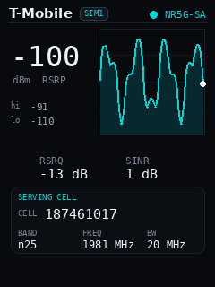
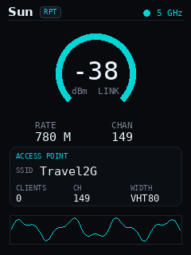
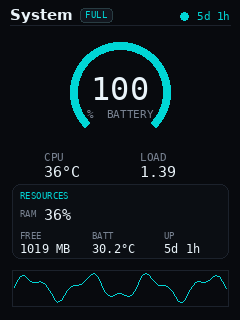
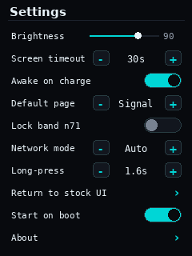

# MudiUI

An EXPERIMENTAL vibe-coded custom front-panel UI for the **GL.iNet GL-E5800 "Mudi"** 5G travel router. 

I am looking for adventerous people to try this out and provide feedback.

MudiUI draws its own dashboard to the Mudi's built-in 240×320 LCD — live cellular signal,
Wi-Fi, system, and Ethernet gauges, plus a touch **Settings** page — as a companion to (and
eventual replacement for) the stock on-screen UI. It's pure Python, event-driven, and sips CPU.

<p align="center">
  
  
  
  
</p>

> **Unofficial project.** Not affiliated with or endorsed by GL.iNet. It takes over the framebuffer
> and can change modem settings (band lock). Use at your own risk — see [Disclaimer](#disclaimer).

## Why

The Mudi is an awesome device and one of it's coolest features is it's large graphical touch screen.
One of the use cases I felt was missing was the ability to use the screen to help me position the
modem correctly by showing me a live view of signal strength / tower / band / bandwith.  So I used
Claude Code to create this series of screens.

## How it works

MudiUI inserts itself first in the boot sequence before GL's gl_screen.  It displays the graphs
and has a settings screen.  

To go back and forth between MudiUI and GL_Screen, long press anywhere on thhe screen for 1.5 seconds.
You'll see a flash and the UI will change.

Unforutantly I couldn't keep GL's screens hot loaded in the background so there will be a few second
pause when GL's screens are loading.  MudiUI does stay hotloaded so flipping back to it will be quick.

##  Architecture

The Mudi's stock screen (`gl_screen`) is a closed LVGL binary — you can relabel or hide existing
items via config, but you **cannot add pages or custom logic** to it. So instead of extending it,
MudiUI draws directly to `/dev/fb0` and reads the capacitive touch panel itself, co-opting the
display rather than the stock app's internals. The two hand the panel back and forth on demand.

## Features

- **Four live instrument pages** — cellular signal (hero trend graph + serving-cell detail),
  Wi-Fi link, system (battery/CPU/RAM), and Ethernet — swipe left/right to navigate.
- **Touch Settings page** — brightness, screen timeout, default page, long-press timing, start on
  boot, and modem controls (band lock, network mode), all persisted in OpenWrt `uci`.
- **Gesture toggle** — long-press the screen to switch between MudiUI and the stock UI. No spare
  hardware button needed; a background watcher makes it the reliable way back.
- **Screen timeout / idle-blank** — backlight sleeps after inactivity; a touch wakes it. Optional
  stay-awake while charging.
- **Efficient by design** — an event-driven object model polls *only* the data a visible page
  needs, and only redraws on change: ~1% of one CPU core at idle (~129 FPS render ceiling).
- **Boots with the router** as a `procd` service.

## Requirements

- A **GL.iNet GL-E5800 "Mudi"** (Qualcomm SDXPINN, aarch64, OpenWrt 23.05 / GL firmware 4.x).
- Root SSH access to the router.
- Python 3 with `numpy`, `pillow`, and `python-evdev` (the installer pulls these from GL's opkg
  feed; `pillow` is installed `--nodeps` to reuse the panel's existing FreeType).

## Install

**One line, on the router.** SSH into the Mudi and run:

```sh
wget -q https://github.com/kevinherzig/MudiUI/releases/latest/download/install-mudiui.sh -O install-mudiui.sh && sh install-mudiui.sh
```

That downloads MudiUI and runs the on-device installer, which **guards the hardware** (refuses to
run on anything that isn't a 240×320 E5800 panel), installs only missing dependencies, deploys the
files, enables both services, registers them in `/etc/sysupgrade.conf`, and starts the UI.
**Re-running it updates in place.** To install a branch/tag other than `main`, set `MUDIUI_REF`.

<details>
<summary>Alternative: install from a local clone (no network fetch on the router)</summary>

The Mudi has no `scp`/sftp, so stream the files with **tar over SSH** (replace the address with
your router's):

```sh
git clone https://github.com/kevinherzig/MudiUI.git && cd MudiUI/src
tar cf - mudi.py mudi-watch.py mudi.init mudi-watch.init mudi.config install.sh uninstall.sh \
| ssh root@192.168.8.1 'mkdir -p /tmp/mudiui && tar xf - -C /tmp/mudiui && sh /tmp/mudiui/install.sh'
```
</details>

## Uninstall

**One line, on the router.** SSH into the Mudi and run:

```sh
wget -qO- https://raw.githubusercontent.com/kevinherzig/MudiUI/main/src/uninstall.sh | sh
```

That stops and disables both services, removes the installed files, strips them from
`/etc/sysupgrade.conf`, and hands the panel back to the stock UI. Like the installer, it's
idempotent and safe to re-run.

Two things it does **not** do: it leaves the opkg dependencies (`numpy`, `pillow`, `evdev`)
installed, since other things may use them; and it **does** delete your settings at
`/etc/config/mudi` — copy that file first if you want to keep them.

If you installed from a local clone, `sh src/uninstall.sh` on the router does the same thing
without the network fetch.

## Usage

- **Swipe** left/right to move between pages; the dots up top show where you are.
- **Long-press** (hold still ~1.6 s) anywhere to toggle between MudiUI and the stock UI. A cyan
  flash confirms the touch. The duration is adjustable on the Settings page.
- **Settings** is the last page (gear dot). Tap `[−]`/`[+]` steppers, drag-tap the brightness
  slider, flip toggles. Modem changes (band lock, network mode) are gated behind a confirm dialog.

Manage the service directly with `/etc/init.d/mudi {start,stop,restart}` and
`/etc/init.d/mudi-watch {...}`.

## How it works

Pure Python, no compiled hot path (measured: PIL draw 2.6 ms + numpy RGB565 pack 5 ms + write
0.08 ms ≈ 129 FPS):

```
PIL draws a frame  ->  numpy packs it to RGB565  ->  write() to /dev/fb0
python-evdev reads /dev/input/event0 for touch
```

The UI is a small object model that the future JSON-scripting layer will target:

- **`DataSource`** — a self-gating subject that polls **only while it has subscribers** and
  notifies them **only on change**. Showing a page subscribes its widgets → the relevant source
  wakes; swiping away drops the subscriptions → it sleeps.
- **`Widget`** — parameterized by data-bus keys, so the same gauge renders different metrics on
  different pages.
- **`Page` / `App`** — bundle widgets, own the sources, handle touch/swipe, settings, idle-blank,
  and the stock-UI handoff.

Settings live in `uci` at `/etc/config/mudi` (survives firmware upgrades automatically).

## Repository layout

```
src/
  mudi.py            the app — Theme, DataSources, Widgets, Pages, Settings, App
  mudi-watch.py      always-on long-press watcher (independent touch reader)
  mudi.init          procd service for the UI
  mudi-watch.init    procd service for the watcher
  mudi.config        default uci settings
  install.sh         on-device installer (hardware-guarded, idempotent)
  uninstall.sh       reverses install, restores the stock UI
docs/                design notes, specs, and screenshots
reference/           stock-UI assets captured from the device for analysis
```

## Status

Working proof-of-concept, running on-device. Known next steps: roll the hero trend graph out to
the Wi-Fi/System/Ethernet pages, a JSON-defined page/widget layer, and optional `.ipk` packaging.

## Contributing

Issues and pull requests welcome. This targets one specific device today; notes on porting the
framebuffer/evdev approach to other GL.iNet screens are of particular interest.

## Disclaimer

MudiUI is an independent, unofficial project. It writes directly to the framebuffer and can issue
AT commands that change modem configuration (e.g. band lock, which persists in modem NV). It is
provided **as-is with no warranty** — you are responsible for what you run on your hardware.
Not affiliated with GL.iNet.

## License

[MIT](LICENSE) © 2026 Kevin Herzig
